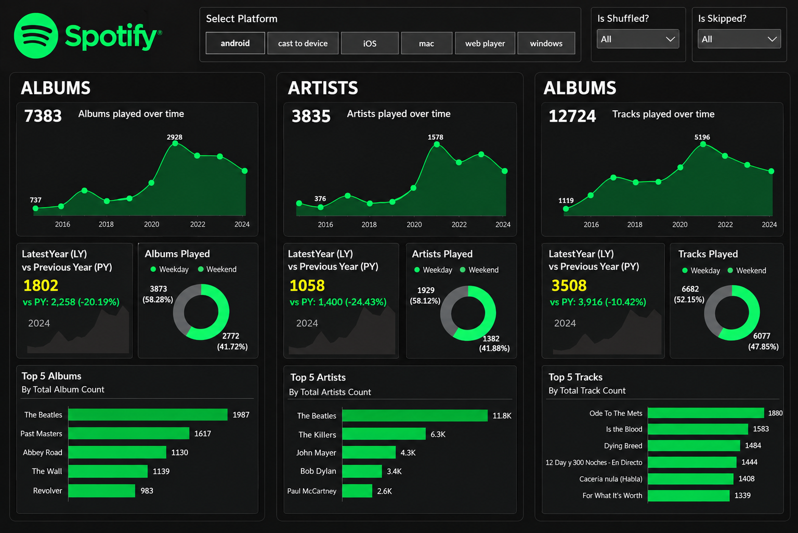
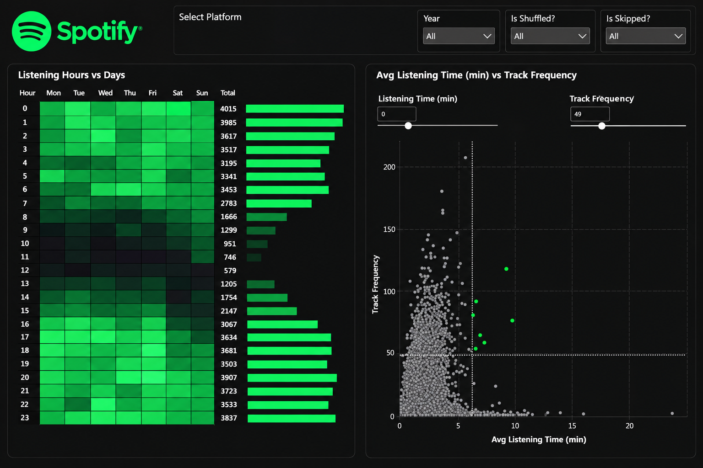
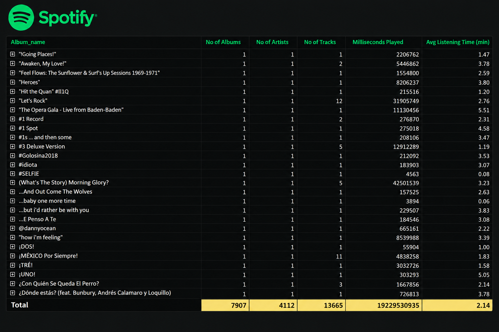

# Spotify Data Analysis & Dashboard 🎵

## Project Overview
This project is an end-to-end interactive Power BI dashboard analyzing Spotify listening patterns, top artists, and album performance. The goal was to transform raw relational data into actionable insights through complex data modeling and DAX calculations. 

## Key Highlights & Technical Skills
* **Data Modeling:** Resolved inactive/active relationship conflicts between multidimensional tables (`people`, `shipments`, `Calendar`).
* **DAX Formulas:** Used advanced DAX measures including `CALCULATE` and `SWITCH(TRUE())` for dynamic filtering and conditional KPI logic.
* **Visualizations:** Designed a dark-themed UI featuring matrix heatmaps, interactive scatter plots, and custom-formatted KPI cards.
* **Tech Stack:** Power BI, SQL, Microsoft Excel.

## Dashboard Previews

### 1. Overview Tab

### 2. Listening Patterns

### 3. Granular Details

*Note: The complete interactive `.pbix` file is included in this repository for a deep dive into the backend data model.*
